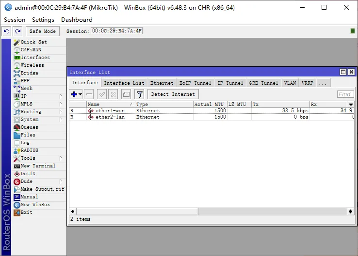

# 基于Vmware实现小型域网络搭建

1、摘要      

       在渗透的日常学习过程中经常需要一个内网环境，本篇文章介绍如何使用Vmware和MikroTik搭建简易的二层内网环境。

2、网络结构

      整个网络分为结构分为三层，第一层模拟外网环境，第二层为DMZ区域，该区域通过边界路由器的端口映射，将第二层网络主机的一些端口映射到边界路由器上对外提供服务，第三层模拟办公网，该层网络为域网络，同时可以控制第二层网络的主机。

整个网络拓扑图如下：

  
IP设置：

第一层网络为（外网）：192.168.59.0/24

第二层网络为（DMZ区域）：192.168.72.0/24

第三层网络为（办公网）：172.16.2.0/24

路由器IP地址：

边界路由器：192.168.59.141 \| 192.168.72.2

内网路由器：192.168.72.254 \| 172.16.2.254

3、网络搭建

3.1网络设置

首先使用VMware的虚拟网络编辑器增加两个网络VMnet2、VMnet3，都勾选仅主机模式，同时取消下面两个勾，如下图：

VMnet3同理，同时在DHCP设置处设置相应的IP地址和掩码。其中外层网络为nat模式，VMnet2为DMZ区域网络，VMnet3为办公网络

3.2虚拟机搭建

整个网络在最少情况下一共需要六台虚拟机，分为两台ROS，四台网络中的主机。

ROS从hxxps://mikrotik.com/download下载stable版本的ova格式的镜像，之后导入到VMware中。一共需要导入两次，分别命名为ROS，ROS-1。除了下载镜像之外还需要下载winbox方便对路由器进行设置。

网络中主机分布：

DMZ：Ubuntu 2004、windows7

办公网：Windows server2019、windows7

创建上述虚拟机，并将DMZ区域的主机的网卡设置为VMnet2，办公网的主机设置为VMnet3.

将边界路由器ROS网卡设置为net模式和VMnet2模式，内网路由器设置为VMnet2和VMnet3模式。

4、IP地址及路由器设置

经历上面的步骤之后，基本的网络拓扑已经搭建完成，接下来需要对网络内的主机和路由器进行设置使得网络中的主机能够相互ping通。

首先设置两个网络中的主机IP地址

DMZ：

Windows7：192.168.72.4/24 网关192.168.72.2 DNS114.114.114.114

Ubuntu ：192.168.72.3/24 网关192.168.72.2 DNS114.

114.114.114

办公网：

Windows server 2019：172.16.2.4/24 网关172.16. 2.254 DNS127.0.0.1

windows7：172.16.2.3/24 网关172.16.2.254 DNS172.16.2.4

至此，两个网络的主机应该可以ping通同一个网络的主机。接下来设置两个ROS的IP地址。

打开winbox，点击Neighbors按钮，会自动嗅探网络内的存活的路由器，如下图所示。

上图为边界路由器的IP地址，如果分配了IP地址则可以在浏览器通过IP地址浏览路由器的web界面，在如果没有分配IP地址则通过wibbox使用MAC地址登录

进入之后，在左侧选项卡会列出路由器拥有的所有网卡接口，点击之后进入到接口详情界面，在里面会列出该接口的一些基本信息，可以通过网卡的MAC分辨该网卡对应在vmware中的网卡，将两个网卡名称分别设置为ether1-wan和ether2-lan，之后在ip-&gt;addresses选项卡中将ether-lan设置为下图。ether1-wan不用设置，因为该网卡网络类型为nat会自动dhcp分配

之后在IP-&gt;Firewall-&gt;NAT中新建规则，chain：srcnat，out.interface:ether2-lan,action:masquerade

该规则将使得路由器两边的网络联通。

